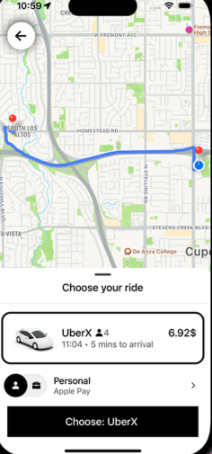

# Uber Clone with React Native and TypeScript

Tech stack:
- React Native
- TypeScript
- emotion-css
- axios
- react-native-maps
- react-native-bottom-sheet
- expo-location
- react-native-reanimated

#### Remember to put your Google API key in `.env` file
